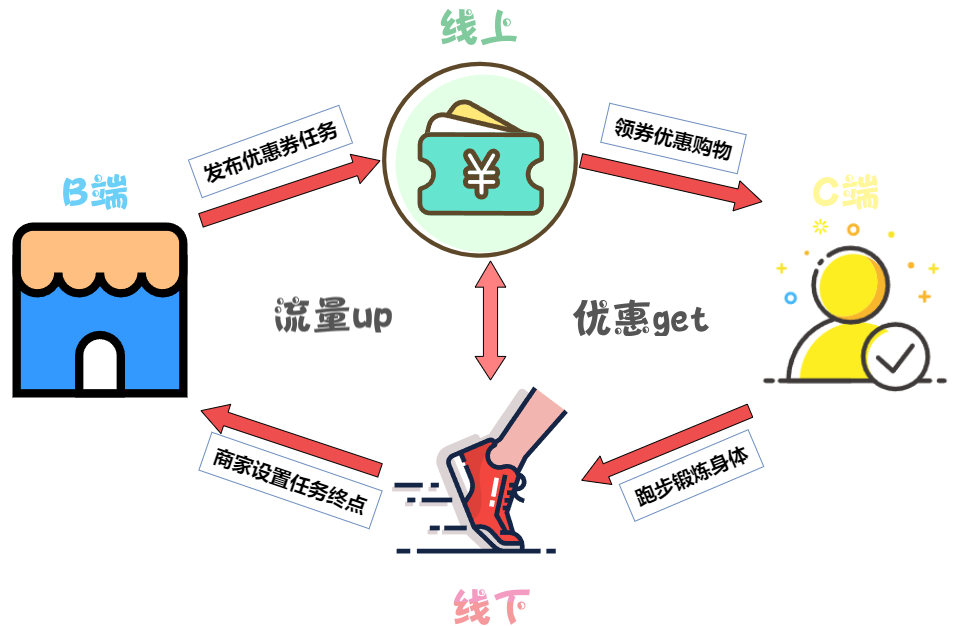
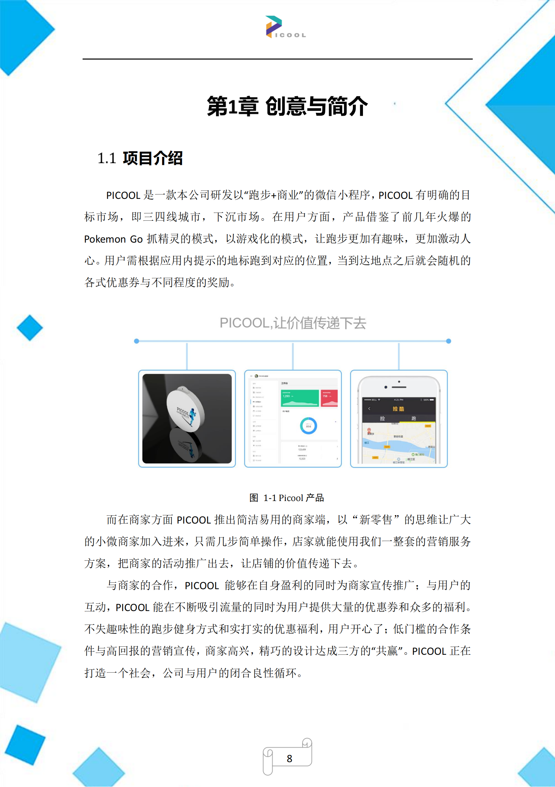
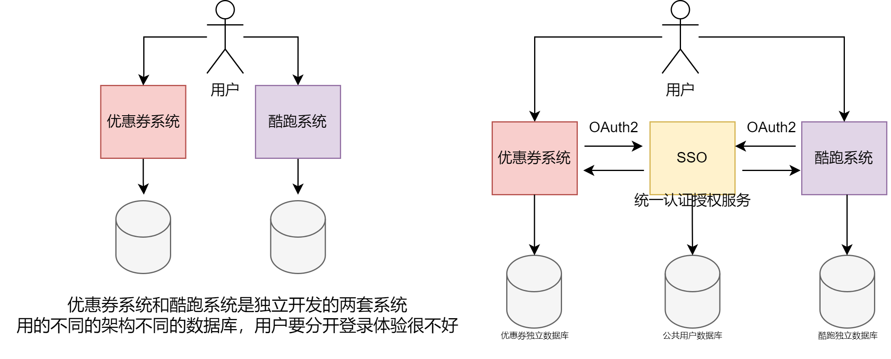
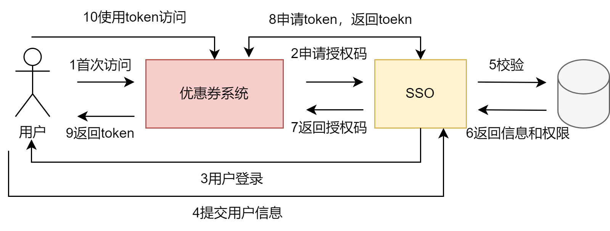
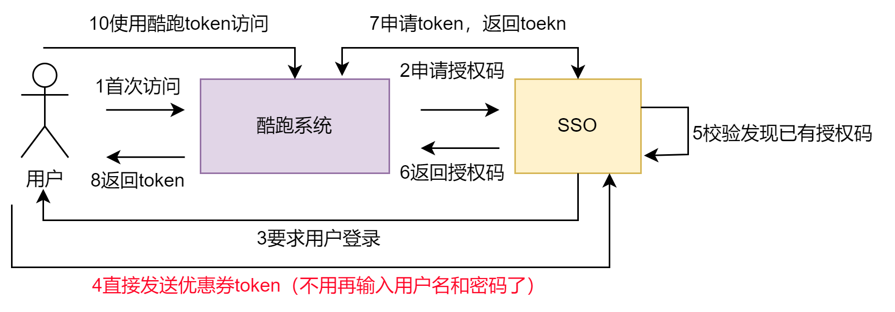
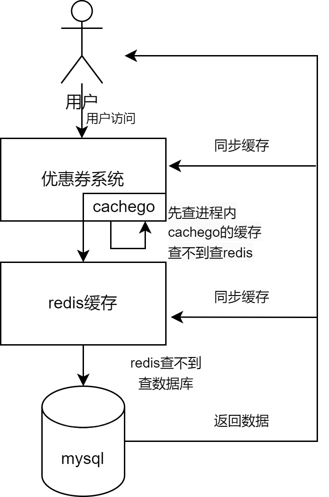

# Picool  '捡酷'
---
## 简介
Picool是一个B2C优惠券酷跑项目，C端用户通过完成指定跑步任务获取对应商家的优惠券，B端商家通过指定任务终点的形式实现精准推广。系统以优惠券为核心，提供有任务中心、天天神券、锻炼计划等功能，实现线上线下的优势互补。

### 原型
这项目的原型是我本科电子商务大赛的一个参赛作品，当时还只有一个概念，现在研究生阶段打算将以前的概念实现。参考了网上的一些优惠券系统设计方案将之实现。

 当时写的计划书，只拿了个二等奖 

## 模块设计
综上整个系统大致可以分为两个系统，优惠券系统和酷跑系统。酷跑系统跟市面上的跑步app差不多，其共功能主要负责，用户任务开始和完成的监控。优惠券系统负责抢券、发券、券推送、核销等优惠券相关功能。因为有两个子系统，所以将用户登录注册抽离，实现SSO单点登录

### 单点登录
基于OAuth2协议实现的SSO单点登录。能够实现一次登录就可以访问酷跑和优惠券两个子系统。将登录模块单独抽离出来作为一个子系统，完成 **登录认证** 和子系统的 **访问授权** 这两个功能。

#### OAuth2.0
这里使用OAuth2.0协议来标准化的实现子系统和认证授权系统的交互。

OAuth2.0是目前最流行的授权机制，用来授权第三方应用，获取用户数据，就是你登录的时候，可以选择的微信登录。其本质上是一种协议，用来规范不同系统和授权服务之间的授权机制的，这里用来实现用户无感知的不同子系统的登录

（上面是标准流程，但是因为是同一个应用，这里实际实现的时候进行了简化，在拿到任意一个token时，下次登录会直接发送这个token，这样上图的3，4直接跳过了）

#### JWT双令牌
OAuth2协议具体使用JWT（json web token）进行实现，使用了jwt双令牌的方式进行无感知刷新。
因为使用token进行登录，token的失效时间会比较短（万一被窃取就有安全问题），但是token经常失效，用户需要频繁登录，体验就会很差。

所以对于活跃的用户，我们不希望它的token经常过期。那它每次访问我都刷新它的token，这个方案可以，但是每次都刷新会给服务器带来较大的压力。使用双token的方案就可以缓解这个问题，假如用户的token过期但是refresh_token没有过期，就是使用refresh_token进行刷新，refresh_token快过期了，再刷新refresh_token

### 多级缓存
缓存就是存储数据副本或计算结果的组件，以便后续可以更快地访问

**读多写少**、**不要求一致性**、**时效要求越低**、**访问频率越高**、对**最终一致性**和**数据丢失**有一定程度的容忍的场景适合使用缓存。

一般应用中的缓存，主要分为 客户端缓存  网络缓存  服务端缓存，该系统主要采用redis+cachego实现的多级缓存。
其中cachego用来做本地缓存，缓存一些较为热点访问量较高的数据，一般是会存储天天神券的相关信息（每个用户几乎都会查看）。
redis用作一级缓存，分布式缓存，用以减少用户直接访问mysql数据库的次数，提升整个系统的吞吐量。

### GEO

 GEO 是 Redis 3.2 版本新增的数据类型，主要用于存储地理位置信息，并对存储的信息进行操作。
 使用redis的GEO数据结构，存储商家的经纬度和任务目的地的经纬度.再酷跑子系统中，app会获取用户的经纬度 
 使用命令：GEORADIUS key 经度 维度  范围 
 获取用户当前距离较近的任务，并由酷跑系统进行两个目标点的路径规划。

### 券设计
普通券：商家发放，用户完成指定跑步任务可得，专用于对应商家的商品优惠
神券：平台发放，通过‘天天神券’模块限量发放，全平台商家可用

### 优惠券的生成与分发
#### 表设计
##### 券模板（券批次）
字段名称     | 含义
-------- | -----
id | 批次id
batch_name | 模板名称
coupon_name  | 优惠券名称
rule_id |  优惠券的规则，外键
total_count |  优惠券发放总数量
assign_count |  已发放的优惠券数
used_count |  已使用的优惠券

每个优惠券都会有的东西将之抽象为一个优惠券模板，商家每次要创建一批优惠券就新增一个优惠券批次，并且可以统计这次优惠券的使用情况。

##### 优惠券规则表

字段名称     | 含义
-------- | -----
rule_id | 规则id
rule_name| 规则名称
type | 规则类型，比如0是普通券1是神券，现在就两个券
rule_content |  规则内容，存入json数据，制定详细优惠规则

者

##### 优惠券表

### B端功能

+ 优惠券发布
+ 跑步任务设置并绑定优惠券
+ 券的查看和统计
+ 券核销

### C端
+ 任务中心功能：附近的商家发布任务推送至任务中心
+ 天天神券功能：抢平台的神券
+ 领取任务，包括任务状态，时限等（跑步系统负责），完成任务出现领券入口
+ 券的使用，同商家核销

